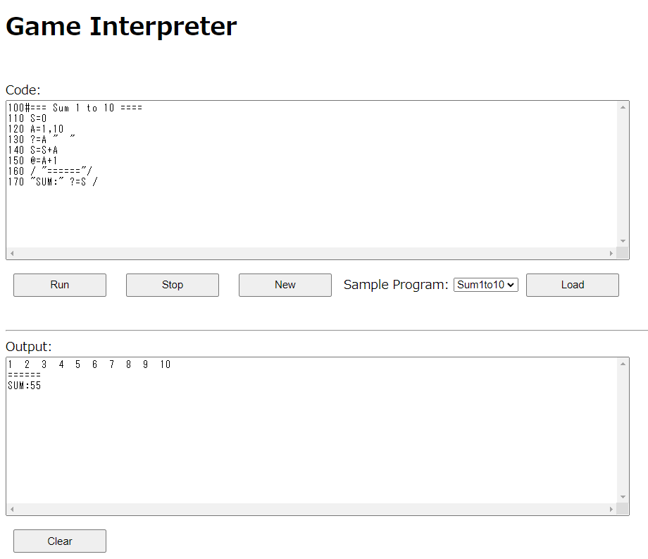

# game-interpreter

1970年代の終わり頃に流行った GAME 言語のインタプリタを Javascript で実装してみたものです。

GAME言語の文法については [http://www.mztn.org/game86/](http://www.mztn.org/game86/)あたりを参照してください。

## Live Demo
[https://g200kg.github.io/game-interpreter/gameinterpreter.html](https://g200kg.github.io/game-interpreter/gameinterpreter.html)

